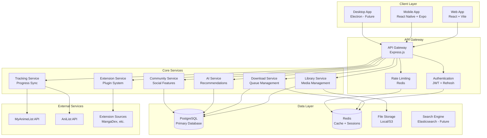

# 🏗 Architecture Guide

## Overview

Project Myriad follows a modern, microservices-inspired architecture with clear separation of concerns. The system is designed to be scalable, maintainable, and extensible.

## System Architecture



## Core Components

### 1. API Gateway Layer

**Purpose**: Single entry point for all client requests with authentication, rate limiting, and routing.

**Components**:
- **Express.js Router**: Main HTTP server and request routing
- **JWT Authentication**: Stateless authentication with refresh tokens
- **Rate Limiting**: Protection against abuse using Redis
- **Request Validation**: Input sanitization and validation
- **CORS Handling**: Cross-origin request management

**File Structure**:
```
backend/
├── index.js                 # Main server entry point
├── middleware/
│   ├── auth.js              # JWT authentication middleware
│   ├── rateLimiter.js       # Rate limiting configuration
│   ├── validation.js        # Request validation
│   └── cors.js              # CORS configuration
└── routes/
    ├── api.js               # Main API router
    ├── auth.js              # Authentication routes
    └── health.js            # Health check endpoints
```

### 2. Core Services

#### Library Service
**Purpose**: Manages the user's media library including local files and external sources.

**Responsibilities**:
- File system scanning and organization
- Metadata extraction and management
- Library synchronization across devices
- Media format conversion and optimization

**Key Features**:
- Support for CBZ, CBR, PDF, EPUB formats
- Automatic metadata detection
- Cover image extraction and caching
- Reading progress tracking
- Series and volume organization

#### Download Service
**Purpose**: Handles downloading content from external sources with queue management.

**Responsibilities**:
- Download queue management
- Parallel download processing
- Progress tracking and notifications
- Error handling and retry logic
- Bandwidth limiting and scheduling

**Key Features**:
- Priority-based queue system
- Resume interrupted downloads
- Automatic quality selection
- Download history and statistics
- Integration with extension sources

#### Extension Service
**Purpose**: Plugin system for adding new manga and anime sources.

**Responsibilities**:
- Extension loading and management
- Sandboxed execution environment
- API standardization for sources
- Extension marketplace integration

**Key Features**:
- Hot-reloading of extensions
- Version management and updates
- Security isolation
- Extension analytics and monitoring
- Community extension sharing

#### Tracking Service
**Purpose**: Syncs reading/watching progress with external services.

**Responsibilities**:
- Integration with MyAnimeList, AniList, Kitsu
- Cross-device progress synchronization
- Statistics and analytics generation
- Reading habit analysis

**Key Features**:
- Automatic progress updates
- Conflict resolution for multi-device usage
- Offline progress caching
- Statistical insights and reports
- Export/import functionality

#### AI Service
**Purpose**: Provides intelligent recommendations and content analysis.

**Responsibilities**:
- Content-based recommendations
- Reading pattern analysis
- Art style and genre classification
- Personalized discovery

**Key Features**:
- Machine learning recommendation engine
- Content similarity analysis
- Reading behavior prediction
- Personalized content curation
- Trend analysis and discovery

#### Community Service
**Purpose**: Social features for user interaction and content sharing.

**Responsibilities**:
- User profiles and social graphs
- Reviews and ratings system
- Content sharing and collections
- Discussion forums and comments

**Key Features**:
- User-generated content moderation
- Social recommendation engine
- Privacy controls and settings
- Community-driven content curation
- Achievement and badge system

### 3. Data Layer

#### PostgreSQL Database
**Purpose**: Primary persistent storage for structured data.

**Schema Design**:
```sql
-- Core entities
users (id, username, email, created_at, settings)
libraries (id, user_id, name, path, type, config)
media_items (id, library_id, title, path, metadata, created_at)
reading_progress (id, user_id, media_id, chapter, page, timestamp)
downloads (id, user_id, source, url, status, progress)

-- Community features
reviews (id, user_id, media_id, rating, content, created_at)
collections (id, user_id, name, description, public)
collection_items (collection_id, media_id, order)

-- Extension system
extensions (id, name, version, manifest, enabled)
extension_sources (id, extension_id, url, config)
```

#### Redis Cache
**Purpose**: High-performance caching and session storage.

**Usage Patterns**:
- Session storage for authentication
- API response caching
- Download queue management
- Real-time notifications
- Rate limiting counters

#### File Storage
**Purpose**: Storage for media files, cover images, and user uploads.

**Storage Options**:
- **Local Filesystem**: Default for self-hosted deployments
- **S3-Compatible**: AWS S3, MinIO, DigitalOcean Spaces
- **Cloud Storage**: Google Cloud Storage, Azure Blob Storage

**Organization**:
```
storage/
├── libraries/
│   ├── {user_id}/
│   │   ├── manga/
│   │   ├── anime/
│   │   └── light-novels/
├── covers/
│   ├── {media_id}.jpg
├── thumbnails/
│   ├── {media_id}_thumb.jpg
└── temp/
    ├── downloads/
    └── processing/
```

## Frontend Architecture

### Web Application (React + Vite)

**State Management**:
- **Zustand**: Lightweight state management with persistence
- **React Query**: Server state management and caching
- **Context API**: UI state and theme management

**Component Architecture**:
```
frontend/src/
├── components/
│   ├── ui/                  # Reusable UI components
│   ├── layout/              # Layout components
│   ├── reader/              # Manga reader components
│   └── library/             # Library management components
├── pages/                   # Route components
├── hooks/                   # Custom React hooks
├── stores/                  # Zustand stores
├── api/                     # API client and queries
├── utils/                   # Utility functions
└── styles/                  # Tailwind CSS styles
```

**Key Features**:
- Progressive Web App (PWA) capabilities
- Offline-first reading experience
- Responsive design for all screen sizes
- Dark/light theme support
- Internationalization ready

### Mobile Application (React Native + Expo)

**Navigation**:
- **Expo Router**: File-based routing system
- **Stack Navigation**: Hierarchical navigation
- **Tab Navigation**: Bottom tab bar for main sections

**Platform Integration**:
- **File System Access**: Local storage management
- **Background Sync**: Offline progress synchronization
- **Push Notifications**: Download and update notifications
- **Biometric Authentication**: Secure app access

## Security Architecture

### Authentication & Authorization

**JWT Token Strategy**:
- Short-lived access tokens (15 minutes)
- Long-lived refresh tokens (30 days)
- Automatic token rotation
- Secure HTTP-only cookies for web clients

**Authorization Levels**:
- **Public**: Unauthenticated access to public content
- **User**: Standard user permissions
- **Premium**: Enhanced features and higher limits
- **Admin**: Administrative access and management

### Data Protection

**Encryption**:
- TLS 1.3 for all API communications
- AES-256 encryption for sensitive data at rest
- bcrypt for password hashing (12 rounds)
- Argon2 for additional security in premium deployments

**Privacy Features**:
- GDPR compliance with data export/deletion
- Configurable data retention policies
- Anonymous usage analytics (opt-in)
- Local-first data architecture option

## Deployment Architecture

### Docker Containerization

**Multi-Stage Builds**:
```dockerfile
# Base stage with common dependencies
FROM node:20-alpine AS base

# Development stage
FROM base AS development

# Build stage
FROM base AS build

# Production stage
FROM node:20-alpine AS production
```

**Container Strategy**:
- **backend**: API server and services
- **frontend**: Nginx with static React build
- **database**: PostgreSQL with persistent volumes
- **cache**: Redis for caching and sessions
- **proxy**: Nginx reverse proxy and load balancer

### Cloud Deployment Options

**Single Instance Deployment**:
- Docker Compose for development and small deployments
- All services on one machine
- SQLite database for simplicity
- Local file storage

**Scalable Deployment**:
- Kubernetes orchestration
- Horizontal pod autoscaling
- PostgreSQL cluster with read replicas
- S3-compatible object storage
- Redis Cluster for high availability

**Managed Service Integration**:
- **Database**: AWS RDS, Google Cloud SQL, Azure Database
- **Storage**: AWS S3, Google Cloud Storage, Azure Blob
- **Cache**: AWS ElastiCache, Google Memorystore, Azure Cache
- **CDN**: CloudFlare, AWS CloudFront, Google CDN

## Performance Optimization

### Backend Optimization

**Database Optimization**:
- Proper indexing strategy
- Connection pooling
- Query optimization and analysis
- Read replicas for heavy queries

**Caching Strategy**:
- Multi-layer caching (Redis, in-memory, CDN)
- Cache invalidation strategies
- Edge caching for static content
- API response caching with TTL

**API Optimization**:
- GraphQL for efficient data fetching
- Pagination for large datasets
- Compression (gzip, Brotli)
- Rate limiting and request optimization

### Frontend Optimization

**Bundle Optimization**:
- Code splitting and lazy loading
- Tree shaking for unused code
- Dynamic imports for routes
- Asset optimization and compression

**Runtime Optimization**:
- Virtual scrolling for large lists
- Image lazy loading and optimization
- Service worker for offline capabilities
- Progressive enhancement

## Monitoring & Observability

### Health Monitoring

**Health Checks**:
- Application health endpoints
- Database connectivity checks
- External service availability
- File system health monitoring

**Metrics Collection**:
- Application performance metrics
- User behavior analytics
- Error tracking and reporting
- Resource usage monitoring

### Logging Strategy

**Structured Logging**:
- JSON-formatted logs
- Request/response logging
- Error tracking and alerting
- User action auditing

**Log Aggregation**:
- Centralized log collection
- Log rotation and retention
- Real-time log analysis
- Alert thresholds and notifications

## Extension Architecture

### Plugin System Design

**Extension Interface**:
```typescript
interface ExtensionManifest {
  name: string;
  version: string;
  description: string;
  author: string;
  source_types: string[];
  permissions: string[];
  entry_point: string;
}

interface SourceExtension {
  search(query: string): Promise<SearchResult[]>;
  getChapters(mangaId: string): Promise<Chapter[]>;
  getPages(chapterId: string): Promise<string[]>;
  getMetadata(mangaId: string): Promise<Metadata>;
}
```

**Sandbox Security**:
- Isolated execution environment
- Limited API access
- Permission-based system
- Resource usage limits

**Extension Lifecycle**:
1. Installation and verification
2. Manifest validation
3. Sandbox initialization
4. Runtime monitoring
5. Automatic updates
6. Error handling and recovery

## Future Architecture Considerations

### Microservices Migration

**Service Boundaries**:
- User management service
- Library management service
- Download orchestration service
- Recommendation engine service
- Community platform service

**Communication Patterns**:
- REST APIs for synchronous communication
- Message queues for asynchronous processing
- Event sourcing for audit trails
- GraphQL federation for unified API

### Scalability Planning

**Horizontal Scaling**:
- Stateless service design
- Database sharding strategies
- CDN integration for global reach
- Load balancing and auto-scaling

**Performance Targets**:
- API response time < 200ms (95th percentile)
- Page load time < 2 seconds
- Mobile app startup < 1 second
- 99.9% uptime SLA

This architecture provides a solid foundation for building a scalable, maintainable, and feature-rich manga and anime platform while maintaining flexibility for future enhancements and growth.
